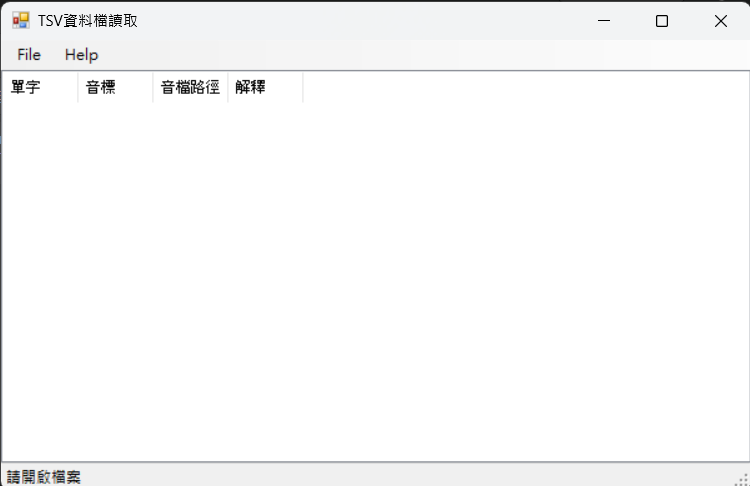

# 資料檔讀取程式

## 專案介紹

這是一個使用 C# Windows Forms 製作的資料檔讀取程式，可以開啟 `.tsv` 或 `.txt` 檔案，並將檔案中的單字資料顯示在 ListView 表格中。

## 功能說明

- 開啟 TSV 或 TXT 檔案
- 讀取單字資料
- 顯示單字、音標、聲音路徑與解釋
- 顯示已載入的單字數量
- 提供離開確認訊息
- 提供關於視窗或關於訊息

## 使用方式

1. 執行程式
2. 點選選單中的「開啟檔案」
3. 選擇 `.tsv` 或 `.txt` 資料檔
4. 程式會將資料載入並顯示在畫面中

## 資料格式

每一筆資料使用 Tab 分隔，格式如下：

| 單字 | 音標 | 聲音路徑 | 解釋 |
|---|---|---|---|
| apple | [ˈæpəl] | sound/apple.mp3 | 蘋果 |
| book | [bʊk] | sound/book.mp3 | 書 |

## 執行畫面

